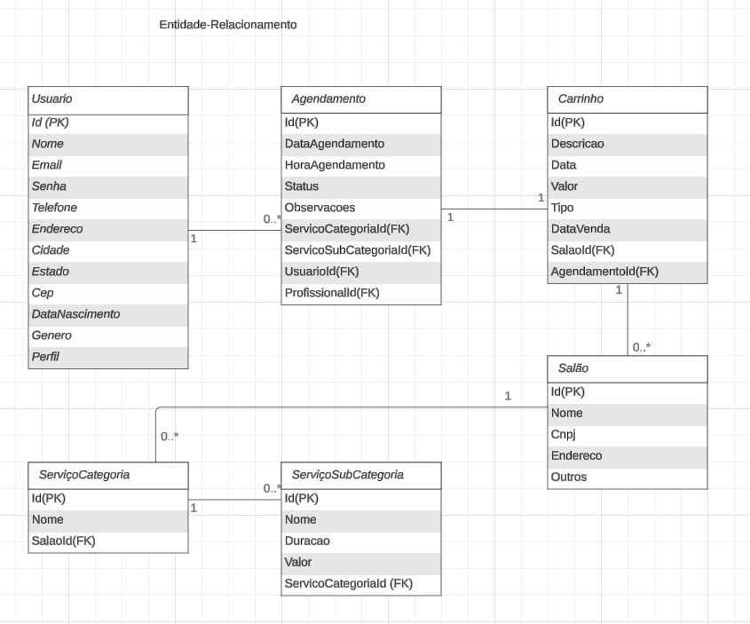
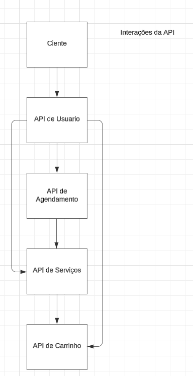

# APIs e Web Services

A aplicação de "Gestão de Salão" está sendo desenvolvida para melhorar a experiência de clientes e donos de salões de beleza, oferecendo uma plataforma digital centralizada que facilita o acesso a serviços de beleza. O sistema visa atender a um público diversificado e proporcionar maior conveniência no processo de agendamento, busca por promoções e interação com os salões. Além disso, o projeto busca otimizar os processos internos dos estabelecimentos, oferecendo ferramentas que facilitam o controle de agendas e o relacionamento com os clientes. Com essa abordagem, o "Gestão de Salão" pretende criar uma solução escalável, integrada e eficiente tanto para usuários quanto para salões.

## Objetivos da API

#### API de Usuario: 
Objetivo: Fornecer funcionalidades que aprimorem a interação dos usuario com os salões. Destinada tanto para usuários finais quanto para integração com outros sistemas de parceiros. 
Recursos Esperados:
- Inclusão de clientes: Possibilitar a inclusão de novos clientes no banco de dados.
- Busca por usuário de clientes: Possibilita localizar o cadastro de clientes no banco de dados.
- Atualização de cadastros: Permite a atualização de informações dos clientes, como endereço, telefone, e-mail, etc.
- Exclusão de clientes: Permitir a exclusão de registros de clientes do sistema.

#### API de Agendamento de serviços: 
Objetivo: Facilitar a marcação de horários com agilidade diretamente pelo aplicativo.
Recursos Esperados: 
- Realização de agendamento: Possibilita que o usuário, salão ou profissionais realize agendamento de serviços em salões.
- Atualização de agendamento: Permite que o salão ou profissionais modifique o agendamento.
- Exclusão de agendamentos: Permite que o usuário, salão ou profissionais cancele um agendamento.
- Serviços oferecidos nesta API:
  1 Retornar todos os agendamentos apenas para usuários com papel de administrador;
  2 Criar novos agendamentos(todos os perfis);
  3 Retornar um agendamento especificos pelo seu Id(Adminsitrador e profissional);
  4 Atualizar um agendamento existente(Administrador e profissional);
  5 Deletar um agendamento(Administrador e profissional);
  6 Retornar um agendamento de um usuário(todos os perfis);
  7 Retornar um agendamento de um profissional(Agendamento do proprio profissional/Admnistrador e profissional);
  8 Atualizar o status de um agendamento(Administrador e profissional);
  9 Cancelar um agendamento(todos os perfis)
  10 Recuperar agendamento de um data especifica(Administrador e profissional);
  11 Recuperar agendamentos dentro de um intervalo de datas(Administrador e profissional);


#### API de Serviços: 
Objetivo: Gerenciar o catálogo de serviços oferecidos pelos salões de beleza e facilitar o acesso dos clientes a esses serviços. Destinada a donos de salão para gestão interna e clientes que utilizam a plataforma para buscar e agendar serviços.
Recursos Esperados: 
- Cadastro de serviços: Permitir que os salões adicionem e atualizem os serviços oferecidos, incluindo preços e tempo estimado de execução.
- Consulta de serviços: Disponibilizar aos clientes uma lista detalhada de serviços oferecidos por cada salão, com filtros por tipo de serviço (corte de cabelo, manicure, tratamentos estéticos, etc.).
- Atualização de portfólio: Permitir que os salões modifiquem o portfólio de serviços, incluindo novas opções ou ajustando as existentes.
- Exclusão de serviços: Permitir que os donos de salão removam serviços que não são mais oferecidos.
- Retornar serviços pelo Id de um profissional.


#### API de Carrinho: 
Objetivo: Gerenciar o carrinho de compras dos usuários, permitindo a seleção e gerenciamento de serviços antes da finalização do agendamento. Destinada a clientes que utilizam a plataforma para escolher serviços e realizar agendamentos. 
Recursos Esperados:
- Adicionar serviço ao carrinho: Permitir que os clientes adicionem serviços ao carrinho enquanto navegam pelo catálogo. Cada serviço selecionado será incluído com detalhes como nome, preço e duração.
- Atualizar itens do carrinho: Oferecer aos clientes a capacidade de modificar os serviços selecionados, como alterar a quantidade (para produtos, se aplicável) ou mudar a data/horário do serviço.
- Remover serviço do carrinho: Permitir a exclusão de um serviço do carrinho de compras, ajustando o total conforme necessário.
- Visualizar carrinho: Disponibilizar uma visão geral do carrinho, incluindo a lista de serviços selecionados, preços totais e possíveis promoções aplicáveis.
- Limpar carrinho: Prover uma opção para que o cliente possa esvaziar completamente o carrinho, removendo todos os itens selecionados de uma vez.


## Arquitetura


Para o projeto Gestao de Salão, utilizamos uma arquitetura de microserviços. Cada API segue um padrão REST(Representational State Transfer), onde cada recurso é representado por um endpoint específico. Os componentes principais incluem:

- Controladores: Responsáveis por receber as requisições HTTP, processá-las e encaminhá-las para os serviços apropriados.
- Serviços: Lógica de negócios que manipula as operações CRUD e outras funcionalidades da aplicação.
- Modelo de Dados: Representação das entidades principais do sistema, como usuários, agendamentos, serviços e carrinho.
- Repositórios: conexão com o camada de banco de dados.


## Modelagem da Aplicação

Segue abaixo a representação do modelo ER e as interações da API.






## Fluxo de Dados

Fluxo de uma requisição típica (exemplo de agendamento de serviço):
- Etapa 1: O cliente faz login pelo aplicativo ou web e envia uma requisição de autenticação ao API Gateway.
- Etapa 2: O API Gateway valida o token de autenticação com o serviço de autenticação e retorna um token JWT.
- Etapa 3: O cliente seleciona um salão e um serviço, adiciona-o ao carrinho através da API de Carrinho.
- Etapa 4: O cliente confirma o agendamento através da API de Agendamento, que cria a reserva no banco de dados.
- Etapa 5: O carrinho de compras recebe o agendamento e espera o pagamento no próprio salão para dar baixa.


### Link do miro para uma visualizaçao mais detalhada

- https://miro.com/welcomeonboard/QlVxYUtWaVJ0YVRmZ2NZTHQwYUtBM2k1blBYeU5RR0Q2ZU03ZjhqV2trWHZrZTRJU0NoZjl1dTliTUN6VE9SdnwzNDU4NzY0NTk3Mzc1MTY3ODc0fDI=?share_link_id=369291618323


## Requisitos Funcionais

| ID     | Descrição do Requisito                                                                                         | Tipo                 | Prioridade | Responsável |
|--------|---------------------------------------------------------------------------------------------------------------|----------------------|------------|------------|
| RF-001 | O sistema deve permitir gestão de usuário.                                                                     | USUÁRIO     | ALTA       |Everton De Souza   [github-repo-link](https://github.com/ICEI-PUC-Minas-PMV-SI/pmv-si-2024-2-pe6-t2-g06-gestao-de-salao-servico-usuario) <br>    |
| RF-002 | O sistema deve permitir gestão de agenda.                                                                      | AGENDA      | ALTA       |Sara Vidal   [github-repo-agendamentos](https://github.com/ICEI-PUC-Minas-PMV-SI/pmv-si-2024-2-pe6-t2-g06-gestao-de-salao-servico-agenda) <br> and  [github-repo-api-gateway](https://github.com/ICEI-PUC-Minas-PMV-SI/pmv-si-2024-2-pe6-t2-g06-gestao-de-salao-api-gateway) <br>    |
| RF-003 | O sitema deve permitir gestão de serviços       | SERVIÇOS    | BAIXA  |Roberto Santos   [github-repo-link](https://github.com/b3tones/pmv-si-2024-2-pe6-t2-g06-gestao-de-salao-servico-servico.git)    |
| RF-004 | O sistema deve possuir gestão de carrinho                                                                       | PAGAMENTO  | ALTA      |Lucas Nascimento e Sarah Moura  [github-repo-link](https://github.com/Lucasmnclima/mf-Carrinho-compras.git)      |
| RF-005 | O sistema deve possuir sistema de notificação                                                                   | MENSAGEM   | BAIXA     |Patrick Magalhães      |


## Requisitos Não Funcionais

| *ID*      | *Categoria*      | *Descrição*                                                                                                                                                                      | *Prioridade* |
|-----------|------------------|----------------------------------------------------------------------------------------------------------------------------------------------------------------------------------|--------------|
| RNF-01    | *Desempenho*     | *Tempo de Resposta*: A aplicação deve carregar as principais funcionalidades, como login e seleção de serviços, em até 1 segundo, idealmente medido em milissegundos.             | Alta         |
| RNF-02    | *Desempenho*     | *Escalabilidade*: O sistema deve suportar entre 20 a 100 acessos simultâneos sem perda significativa de desempenho.                                                              | Média        |
| RNF-03    | *Desempenho*     | *Capacidade de Processamento*: A aplicação deve processar múltiplas requisições simultâneas, especialmente durante horários de pico, sem afetar a performance.       | Alta         |
| RNF-04    | *Usabilidade*    | *Interface Amigável*: A interface deve ser intuitiva e otimizada para dispositivos móveis e navegadores web, facilitando a navegação entre páginas de cadastro, escolha de serviços e agendamento. | Alta         |
| RNF-05    | *Usabilidade*    | *Compatibilidade*: A aplicação deve ser responsiva e garantir uma excelente experiência em dispositivos móveis (Android e iOS) e em navegadores web modernos. | Alta         |
| RNF-06    | *Usabilidade*    | *Documentação Básica*: Incluir uma breve documentação ou tutorial que ajude os usuários a entender como usar a aplicação.                                                         | Média        |
| RNF-07    | *Segurança*      | *Autenticação*: Implementar autenticação básica para garantir que apenas pessoas autorizadas possam acessar ou modificar informações.                                                | Alta         |
| RNF-08    | *Segurança*      | *Hashing Simples*: Implementar hashing para senhas utilizando um algoritmo de pelo menos 256 bits para garantir a segurança.                                                     | Alta         |
| RNF-09    | *Segurança*      | *Proteção de Dados Pessoais*: Armazenar dados pessoais dos usuários de forma segura, utilizando o hashing de senhas especificado acima.                                           | Alta         |
| RNF-10    | *Confiabilidade* | *Backup Semanal*: Realizar backups semanais dos dados críticos, com automatização para garantir a segurança e recuperação dos dados.               | Média        |
| RNF-11    | *Confiabilidade* | *Estabilidade Básica*: A aplicação deve funcionar de forma estável durante as demonstrações e testes, sem quedas frequentes.                                                     | Alta         |
| RNF-12    | *Maneabilidade*  | *Código Limpo e Bem Comentado*: Garantir um código organizado e comentado facilita a manutenção e a compreensão por outros desenvolvedores. | Baixa        |
| RNF-13    | *Portabilidade*  | *Compatibilidade com Sistemas Operacionais e Navegadores*: A aplicação deve ser compatível com dispositivos móveis rodando Android e iOS e com navegadores web modernos.   


## Tecnologias Utilizadas

A ideia é desenvolver uma api REST utilizando a linguagem C#(contudo poderá haver uma alteraçao conforme a necessidade e demanda dos integrantes do grupo) e o framework Asp.net core. Para armazenamento foi utilizado o banco de dados relacional MySql. Lista das tecnologias:

| Tecnologia | Aplicação |
|---|---|
| C# | Implementação do Backend |
| Asp.net core | Framework |
| SqlServer | Banco de Dados |
| Autenticação | JWT |
| ....... | Deploy da web api |


## API Endpoints

[Liste os principais endpoints da API, incluindo as operações disponíveis, os parâmetros esperados e as respostas retornadas.]

### Endpoint 1
- Método: GET
- URL: /endpoint1
- Parâmetros:
  - param1: [descrição]
- Resposta:
  - Sucesso (200 OK)
    ```
    {
      "message": "Success",
      "data": {
        ...
      }
    }
    ```
  - Erro (4XX, 5XX)
    ```
    {
      "message": "Error",
      "error": {
        ...
      }
    }
    ```


## Considerações de Segurança

Para garantir os requisitos de confidenciabilidade e integridade da api, foi utilizado o JWT, que é um token criptografado de autenticação, com declarações sobre um usuário e uma chave, além dos recursos de autorização do framework asp.net core para restringir o acesso a determinadas funcionalidades da api e recursos anti-fraude.

## Implantação

[Instruções para implantar a aplicação distribuída em um ambiente de produção.]

1. Defina os requisitos de hardware e software necessários para implantar a aplicação em um ambiente de produção.
2. Escolha uma plataforma de hospedagem adequada, como um provedor de nuvem ou um servidor dedicado.
3. Configure o ambiente de implantação, incluindo a instalação de dependências e configuração de variáveis de ambiente.
4. Faça o deploy da aplicação no ambiente escolhido, seguindo as instruções específicas da plataforma de hospedagem.
5. Realize testes para garantir que a aplicação esteja funcionando corretamente no ambiente de produção.

## Testes

[Descreva a estratégia de teste, incluindo os tipos de teste a serem realizados (unitários, integração, carga, etc.) e as ferramentas a serem utilizadas.]

1. Crie casos de teste para cobrir todos os requisitos funcionais e não funcionais da aplicação.
2. Implemente testes unitários para testar unidades individuais de código, como funções e classes.
3. Realize testes de integração para verificar a interação correta entre os componentes da aplicação.
4. Execute testes de carga para avaliar o desempenho da aplicação sob carga significativa.
5. Utilize ferramentas de teste adequadas, como frameworks de teste e ferramentas de automação de teste, para agilizar o processo de teste.

# Referências

- Alguns tópicos do seguinte site: https://medium.com/beelabacademy, como Domain Driven Design, Implementando na prática Rest API com conceitos de DDD + .NET CORE + SQL no Docker + IoC entre outros.
- https://github.com/KleberSouza/mf-apis-web-services-fuel-manager/tree/master


