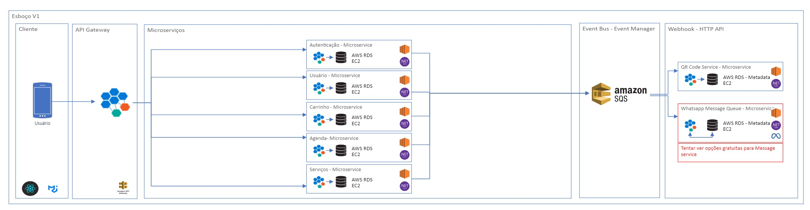

# Introdução

Atualmente a tecnologia desempenha muito importante na sociedade, melhorando aspectos de nossa vida e a forma como interagimos com o mundo ao nosso redor. Com seu avanço e expansão pelo mercado global, suas aplicações se expandem para diversas áreas. O aumento da demanda por facilidade no uso de serviços e experiências personalizadas tem impulsionado o uso da tecnologia no gerenciamento de empresas de setores considerados tradicionais, permitindo que ofereçam uma experiência mais satisfatória ao cliente.

Foi nesse contexto que surgiu o projeto "Gestão de Salão". Uma aplicação voltada para atender às necessidades dos clientes dos salões, melhorando sua experiência. Além disso, a aplicação também é foi pensada para melhorar alguns processos básicos de controle interno. Este projeto visa transformar digitalmente o setor de salões de beleza, por meio da criação de uma plataforma que permite aos usuários agendar serviços, acessar promoções e realizar check-ins de forma rápida e prática pelo smartphone. 

## Problema

Em entrevista com algumas pessoas localizadas na cidade de Minas Gerias, descobrimos um problema pouco explorado por empresas de tecnologia. As pessoas, em sua maioria mulheres, quando precisam realizar uma busca por salões de beleza, encontram dificuldade na centralização dessas informações.

## Objetivos

Objetivo geral: desenvolvimento de uma aplicação distribuída para gestão de Salão.
Delimitação: iremos nos focar apenas em serviços de beleza.

O objetivo da criação da aplicação é a ideia de maximizar o contato entre clientes e salões. Com a ideia, pretendemos implementar um modo onde cada usuário final possa escolher o melhor serviço e local, com uma pesquisa mais simples e limpa. Ofereceremos praticidade, segurança, conforto, otimização, flexibilidade e modernidade, tanto aos salões, quanto aos clientes.

## Justificativa

Faremos uma aplicação que possa ser estudada e reaproveitada futuramente. A ideia é treinarmos fundamentos de sistema distribuído, integrando o desenvolvimento web e o mobile.

## Público-Alvo

O aplicativo "Gestão de Salão" é direcionado ao público conectado com faixa etária entre 16 e 70 anos, tanto homens quanto mulheres, na região metropolitana de Belo Horizonte que buscam conveniência e qualidade em seus cuidados pessoais. Esse público valoriza a praticidade e a modernidade, preferindo soluções tecnológicas que otimizem seu tempo e facilitem o acesso a serviços de beleza. Inclui tanto clientes frequentes de salões, que desejam um relacionamento contínuo e vantajoso com seus estabelecimentos preferidos, quanto novos clientes em busca de opções confiáveis e acessíveis na área de beleza.

 
# Especificações do Projeto

## Requisitos

As tabelas que se seguem apresentam os requisitos funcionais e não funcionais que detalham o escopo do projeto. Para determinar a prioridade de requisitos, aplicar uma técnica de priorização de requisitos e detalhar como a técnica foi aplicada.

### Requisitos Funcionais

| ID     | Descrição do Requisito                                                                                         | Tipo                 | Prioridade | Responsável |
|--------|---------------------------------------------------------------------------------------------------------------|----------------------|------------|------------|
| RF-001 | O sistema deve permitir gestão de usuário.                                                                     | USUÁRIO     | ALTA       |Nome Aqui       |
| RF-002 | O sistema deve permitir gestão de agenda.                                                                      | AGENDA      | ALTA       |Nome Aqui        |
| RF-003 | O sitema deve permitir gestão de serviços, tais como: serviços oferecidos, qr code service, baixa no sistema, histórico, reviews e etc.       | SERVIÇOS    | BAIXA  |Nome Aqui        |
| RF-004 | O sistema deve possuir gestão de carrinho                                                                       | PAGAMENTO  | ALTA      |Nome Aqui        |
| RF-005 | O sistema deve possuir sistema de notificação                                                                   | MENSAGEM   | BAIXA     |Nome Aqui        |

### Requisitos Não Funcionais

| *ID*      | *Categoria*      | *Descrição*                                                                                                                                                                      | *Prioridade* |
|-----------|------------------|----------------------------------------------------------------------------------------------------------------------------------------------------------------------------------|--------------|
| RNF-01    | *Desempenho*     | *Tempo de Resposta*: A aplicação deve carregar as principais funcionalidades, como login e seleção de serviços, em até 1 segundo, idealmente medido em milissegundos.             | Alta         |
| RNF-02    | *Desempenho*     | *Escalabilidade*: O sistema deve suportar entre 20 a 100 acessos simultâneos sem perda significativa de desempenho.                                                              | Média        |
| RNF-03    | *Desempenho*     | *Capacidade de Processamento*: A aplicação deve processar múltiplas requisições simultâneas, especialmente durante horários de pico, sem afetar a performance.       | Alta         |
| RNF-04    | *Usabilidade*    | *Interface Amigável*: A interface deve ser intuitiva e otimizada para dispositivos móveis e navegadores web, facilitando a navegação entre páginas de cadastro, escolha de serviços e agendamento. | Alta         |
| RNF-05    | *Usabilidade*    | *Compatibilidade*: A aplicação deve ser responsiva e garantir uma excelente experiência em dispositivos móveis (Android e iOS) e em navegadores web modernos. | Alta         |
| RNF-06    | *Usabilidade*    | *Documentação Básica*: Incluir uma breve documentação ou tutorial que ajude os usuários a entender como usar a aplicação.                                                         | Média        |
| RNF-07    | *Segurança*      | *Autenticação*: Implementar autenticação básica para garantir que apenas pessoas autorizadas possam acessar ou modificar informações.                                                | Alta         |
| RNF-08    | *Segurança*      | *Hashing Simples*: Implementar hashing para senhas utilizando um algoritmo de pelo menos 256 bits para garantir a segurança.                                                     | Alta         |
| RNF-09    | *Segurança*      | *Proteção de Dados Pessoais*: Armazenar dados pessoais dos usuários de forma segura, utilizando o hashing de senhas especificado acima.                                           | Alta         |
| RNF-10    | *Confiabilidade* | *Backup Semanal*: Realizar backups semanais dos dados críticos, com automatização para garantir a segurança e recuperação dos dados.               | Média        |
| RNF-11    | *Confiabilidade* | *Estabilidade Básica*: A aplicação deve funcionar de forma estável durante as demonstrações e testes, sem quedas frequentes.                                                     | Alta         |
| RNF-12    | *Maneabilidade*  | *Código Limpo e Bem Comentado*: Garantir um código organizado e comentado facilita a manutenção e a compreensão por outros desenvolvedores. | Baixa        |
| RNF-13    | *Portabilidade*  | *Compatibilidade com Sistemas Operacionais e Navegadores*: A aplicação deve ser compatível com dispositivos móveis rodando Android e iOS e com navegadores web modernos.                                                      | Alta         |
| RNF-14    | *Escalabilidade* | *Suporte para Usuários Simultâneos*: O sistema deve suportar de 20 a 100 acessos simultâneos sem perda de performance, permitindo uma escalabilidade básica adequada ao contexto de demonstração. | Média        |

## Restrições

O projeto está restrito pelos itens apresentados na tabela a seguir.

|ID| Restrição                                             |
|--|-------------------------------------------------------|
|01| O projeto deverá ser entregue até o final do semestre |
|02| Deve ser desenvolvido uma aplicação web               |
|03| Deve ser desenvolvida uma aplicação mobile            |

# Catálogo de Serviços

## Serviços Cliente:
### Cadastro/Login:
- Características: Este serviço permite que cliente realize cadastro de uma conta personalizada. Aqui o usuário ainda poderá fazer login no aplicativo, alterar senha ou até mesmo deletar sua conta.

### Localização/Busca de salões:
- Características: Este serviço permite que o cliente veja a lista de salões disponíveis (que estejam cadasrados na aplicação) de acordo com sua região (raio de 20 km).

### Agendamentos:
- Características: Esse serviço permitirá que o usuário poderá realizr o agendamento de atendimento de acordo com a lista de serviços oferecidos por cada estabelecimento, escolher o profissional do estabelecimento e até mesmo classificar com uma pontuação a qualidade do atendimento. O usuário tamém terá a opção de cancelar um agendamento de acordo com as políticas de cancelamento previamente apresentadas.

## Serviços Salão
### Cadastro/Login:
- Características: Este serviço permite que o salão realize cadastro da conta, serviços oferecidos, profissionais e informações gerais. Aqui o dono do salão também poderá fazer login no aplicativo, alterar senha ou até mesmo deletar sua conta.
  
### Controle de agenda:
- Características: Este serviço permite que o estabelecimento veja a lista de agendamentos efetuados em seu calendário. Os profissionais ou o gestor do estabelecimento tamém terá a opção de cancelar um agendamento de acordo com as políticas de cancelamento.
# Arquitetura da Solução

Versão 1 - Esboço -->>> (melhorar arquitetura)

## Tecnologias Utilizadas

Descreva aqui qual(is) tecnologias você vai usar para resolver o seu problema, ou seja, implementar a sua solução. Liste todas as tecnologias envolvidas, linguagens a serem utilizadas, serviços web, frameworks, bibliotecas, IDEs de desenvolvimento, e ferramentas.

Apresente também uma figura explicando como as tecnologias estão relacionadas ou como uma interação do usuário com o sistema vai ser conduzida, por onde ela passa até retornar uma resposta ao usuário.

## Hospedagem

Explique como a hospedagem e o lançamento da plataforma foi feita.

> **Links Úteis**:
>
> - [Website com GitHub Pages](https://pages.github.com/)
> - [Programação colaborativa com Repl.it](https://repl.it/)
> - [Getting Started with Heroku](https://devcenter.heroku.com/start)
> - [Publicando Seu Site No Heroku](http://pythonclub.com.br/publicando-seu-hello-world-no-heroku.html)
