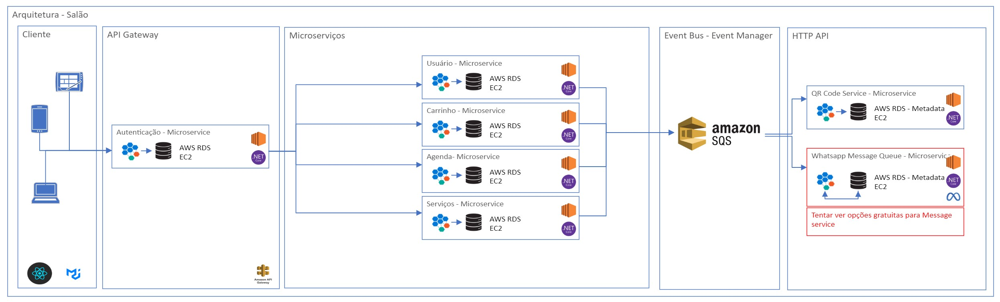

# Introdução

Atualmente a tecnologia desempenha um papel muito importante na sociedade, melhorando aspectos de nossa vida e a forma como interagimos com o mundo ao nosso redor. Com seu avanço e expansão pelo mercado global, suas aplicações se expandem para diversas áreas. O aumento da demanda por facilidade no uso de serviços e experiências personalizadas tem impulsionado o uso da tecnologia no gerenciamento de empresas em setores considerados tradicionais, permitindo que ofereçam uma experiência mais satisfatória ao cliente.

Foi nesse contexto que surgiu o projeto "Gestão de Salão". Uma aplicação voltada para atender às necessidades dos clientes dos salões, melhorando sua experiência em relação a centralização de serviços em uma só plataforma, que permite aos usuários agendar serviços, acessar promoções e realizar check-ins de forma rápida e prática. Além disso, a aplicação também foi pensada para melhorar alguns processos básicos de controle interno dos estabelecimentos. 

## Problema

Identificamos a dificuldade de encontrar salões de beleza de qualidade, após experiência de uma integrante do grupo. A diversidade de salões e a falta de uma plataforma centralizada dificultaram a escolha do estabelecimento ideal. A busca por um salão resultou em horas gastas navegando por sites desatualizados, redes sociais com informações incompletas ou mesmo a tentativa e erro, o que levou a uma experiência frustrante.
Essa dificuldade se intensificou quando o serviço procurado era específico, como um corte especializado ou tratamentos de beleza personalizados, que não estavam bem descritos online. Além disso, a falta de avaliações confiáveis e a ausência de sistemas de agendamento online em muitos salões da região contribuíram para a insegurança na escolha, levando a decisão final pela escolha de um salão distante, porém conhecido.

## Objetivos

O projeto tem como objetivo criar uma plataforma digital que centralize informações sobre salões de beleza, facilitando a vida dos consumidores. Com o projeto "Gestão de Salão", esperamos:

- Desenvolver uma aplicação que ajude os usuários a encontrar salões próximos, filtrando por localização, tipo de serviço, horários disponíveis e avaliações de outros clientes.
- Permitir que os clientes agendem serviços, acessem promoções e façam check-ins de maneira rápida e prática pelo smartphone.
- Melhorar a comunicação entre clientes e salões, reduzindo o tempo de espera e organizando melhor os horários.
- Fornecer aos donos de salões ferramentas que ajudem no controle de agendas, estoques e no relacionamento com os clientes.

## Justificativa

Muitos salões de beleza ainda não utilizam a tecnologia para melhorar a experiência dos clientes. Isso torna mais difícil para as pessoas encontrarem salões, agendarem horários e aproveitarem promoções de forma prática. Com esse projeto, buscamos criar uma solução simples e direta que ajude os clientes a encontrar o que precisam de forma rápida e ajude os salões a se organizarem melhor e atenderem seus clientes de maneira mais eficiente.

## Público-Alvo

O aplicativo "Gestão de Salão" é voltado para o público conectado, com idades entre 16 e 70 anos, tanto homens quanto mulheres, da região metropolitana de Belo Horizonte, que buscam conveniência e qualidade em seus cuidados pessoais. Esse público valoriza a praticidade e a modernidade, preferindo soluções tecnológicas que otimizem seu tempo e facilitem o acesso a serviços de beleza. Inclui tanto clientes frequentes de salões, que desejam manter um relacionamento contínuo e vantajoso com seus estabelecimentos preferidos, quanto novos clientes que procuram opções confiáveis e acessíveis na área de beleza.
 
# Especificações do Projeto

## Requisitos

As tabelas que se seguem apresentam os requisitos funcionais e não funcionais que detalham o escopo do projeto. Para determinar a prioridade de requisitos, aplicar uma técnica de priorização de requisitos e detalhar como a técnica foi aplicada.

### Requisitos Funcionais

| ID     | Descrição do Requisito                                                                                         | Tipo                 | Prioridade | Responsável |
|--------|---------------------------------------------------------------------------------------------------------------|----------------------|------------|------------|
| RF-001 | O sistema deve permitir gestão de usuário.                                                                     | USUÁRIO     | ALTA       |Everton De Souza       |
| RF-002 | O sistema deve permitir gestão de agenda.                                                                      | AGENDA      | ALTA       |Sara Vidal       |
| RF-003 | O sitema deve permitir gestão de serviços, tais como: serviços oferecidos, qr code service, baixa no sistema, histórico, reviews e etc.       | SERVIÇOS    | BAIXA  |Roberto Santos       |
| RF-004 | O sistema deve possuir gestão de carrinho                                                                       | PAGAMENTO  | ALTA      |Lucas Nascimento e Sarah Moura       |
| RF-005 | O sistema deve possuir sistema de notificação                                                                   | MENSAGEM   | BAIXA     |Patrick Magalhães      |

### Requisitos Não Funcionais

| *ID*      | *Categoria*      | *Descrição*                                                                                                                                                                      | *Prioridade* |
|-----------|------------------|----------------------------------------------------------------------------------------------------------------------------------------------------------------------------------|--------------|
| RNF-01    | *Desempenho*     | *Tempo de Resposta*: A aplicação deve carregar as principais funcionalidades, como login e seleção de serviços, em até 1 segundo, idealmente medido em milissegundos.             | Alta         |
| RNF-02    | *Desempenho*     | *Escalabilidade*: O sistema deve suportar entre 20 a 100 acessos simultâneos sem perda significativa de desempenho.                                                              | Média        |
| RNF-03    | *Desempenho*     | *Capacidade de Processamento*: A aplicação deve processar múltiplas requisições simultâneas, especialmente durante horários de pico, sem afetar a performance.       | Alta         |
| RNF-04    | *Usabilidade*    | *Interface Amigável*: A interface deve ser intuitiva e otimizada para dispositivos móveis e navegadores web, facilitando a navegação entre páginas de cadastro, escolha de serviços e agendamento. | Alta         |
| RNF-05    | *Usabilidade*    | *Compatibilidade*: A aplicação deve ser responsiva e garantir uma excelente experiência em dispositivos móveis (Android e iOS) e em navegadores web modernos. | Alta         |
| RNF-06    | *Usabilidade*    | *Documentação Básica*: Incluir uma breve documentação ou tutorial que ajude os usuários a entender como usar a aplicação.                                                         | Média        |
| RNF-07    | *Segurança*      | *Autenticação*: Implementar autenticação básica para garantir que apenas pessoas autorizadas possam acessar ou modificar informações.                                                | Alta         |
| RNF-08    | *Segurança*      | *Hashing Simples*: Implementar hashing para senhas utilizando um algoritmo de pelo menos 256 bits para garantir a segurança.                                                     | Alta         |
| RNF-09    | *Segurança*      | *Proteção de Dados Pessoais*: Armazenar dados pessoais dos usuários de forma segura, utilizando o hashing de senhas especificado acima.                                           | Alta         |
| RNF-10    | *Confiabilidade* | *Backup Semanal*: Realizar backups semanais dos dados críticos, com automatização para garantir a segurança e recuperação dos dados.               | Média        |
| RNF-11    | *Confiabilidade* | *Estabilidade Básica*: A aplicação deve funcionar de forma estável durante as demonstrações e testes, sem quedas frequentes.                                                     | Alta         |
| RNF-12    | *Maneabilidade*  | *Código Limpo e Bem Comentado*: Garantir um código organizado e comentado facilita a manutenção e a compreensão por outros desenvolvedores. | Baixa        |
| RNF-13    | *Portabilidade*  | *Compatibilidade com Sistemas Operacionais e Navegadores*: A aplicação deve ser compatível com dispositivos móveis rodando Android e iOS e com navegadores web modernos.                                                      | Alta         |

## Restrições

O projeto está restrito pelos itens apresentados na tabela a seguir.

|ID| Restrição                                             |
|--|-------------------------------------------------------|
|01| O projeto deverá ser entregue até o final do semestre |
|02| Deve ser desenvolvido uma aplicação web               |
|03| Deve ser desenvolvida uma aplicação mobile            |

# Catálogo de Serviços

## Serviços Cliente:
### Cadastro/Login:
- Características: Este serviço permite que o cliente realize o cadastro de uma conta personalizada. O usuário pode fazer login no aplicativo, alterar a senha ou até mesmo deletar sua conta.
  
### Localização/Busca de salões:
- Características: Este serviço permite que o cliente veja a lista de salões disponíveis (que estejam cadastrados na aplicação) de acordo com sua região, com um raio de até 20 km.

### Agendamentos:
- Características: : Esse serviço permite que o usuário realize o agendamento de atendimentos de acordo com a lista de serviços oferecidos por cada estabelecimento. O cliente pode escolher o profissional do salão e classificar o atendimento com uma pontuação. O usuário também terá a opção de cancelar um agendamento de acordo com as políticas de cancelamento previamente apresentadas.
  
## Serviços Salão
### Cadastro/Login:
- Características:Este serviço permite que o salão realize o cadastro da conta, dos serviços oferecidos, dos profissionais e das informações gerais. O proprietário do salão também pode fazer login no aplicativo, alterar a senha ou até mesmo deletar sua conta.
  
### Controle de agenda:
- Características: Este serviço permite que o estabelecimento visualize a lista de agendamentos efetuados em seu calendário. Os profissionais ou o gestor do salão também terão a opção de cancelar um agendamento, conforme as políticas de cancelamento estabelecidas.
  
# Arquitetura da Solução

Versão 1 - Esboço -->>> (melhorar arquitetura)

## Tecnologias Utilizadas

Descreva aqui qual(is) tecnologias você vai usar para resolver o seu problema, ou seja, implementar a sua solução. Liste todas as tecnologias envolvidas, linguagens a serem utilizadas, serviços web, frameworks, bibliotecas, IDEs de desenvolvimento, e ferramentas.

Apresente também uma figura explicando como as tecnologias estão relacionadas ou como uma interação do usuário com o sistema vai ser conduzida, por onde ela passa até retornar uma resposta ao usuário.

## Hospedagem

Explique como a hospedagem e o lançamento da plataforma foi feita.

> **Links Úteis**:
>
> - [Website com GitHub Pages](https://pages.github.com/)
> - [Programação colaborativa com Repl.it](https://repl.it/)
> - [Getting Started with Heroku](https://devcenter.heroku.com/start)
> - [Publicando Seu Site No Heroku](http://pythonclub.com.br/publicando-seu-hello-world-no-heroku.html)
