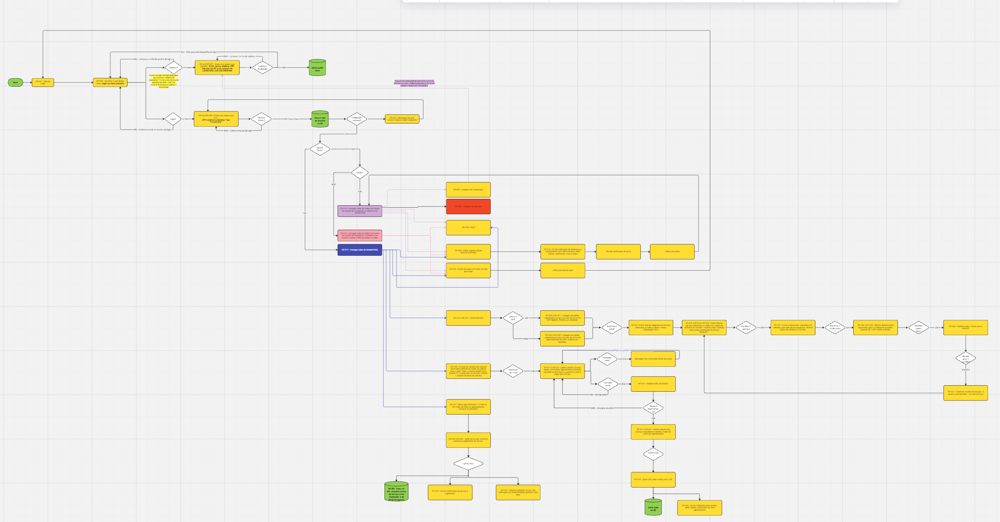

# Front-end Móvel

O projeto "Gestão de Salão" tem como objetivo proporcionar uma experiência prática e eficiente para clientes e salões de beleza, facilitando o agendamento de serviços, pagamentos e check-ins digitais por meio de uma aplicação móvel. A aplicação visa atender às necessidades do público-alvo conectado, oferecendo uma interface intuitiva e moderna para dispositivos Android e iOS. Os objetivos principais do projeto são:
- Facilitar a busca por serviços e profissionais com base em diferentes critérios.
- Permitir o agendamento de serviços de maneira rápida e segura.
- Fornecer informações detalhadas sobre os serviços e agendamentos.
- Oferecer uma interface amigável e acessível em diversos dispositivos móveis.

(Repositório: 

## Tecnologias Utilizadas

- Front-end: React Native
- Gerenciamento de Estado: Redux
- Design: Figma (para prototipagem e wireframes)
- Comunicação com Backend: Axios (consumo de APIs RESTful)
- Estilização: Styled Components
- Testes: Jest e React Native Testing Library

## Arquitetura

Para garantir uma organização robusta, manutenibilidade e escalabilidade na aplicação, adotaremos o padrão de arquitetura MVVM (Model-View-ViewModel). Essa abordagem divide as responsabilidades em camadas bem definidas, promovendo uma separação clara entre interface, lógica de negócios e manipulação de dados.

A seguir, detalharemos como cada camada será implementada:

**View:** Componentes desenvolvidos em React Native, responsáveis por apresentar a interface do usuário e capturar interações.  
**ViewModel**: A camada intermediária que concentra a lógica de negócios, gerencia o estado da aplicação e atua como um elo entre a View e o Model.  
**Model:** Representa os dados do domínio e suas operações, além de encapsular a comunicação com a API para acesso e manipulação das informações.  

Essa arquitetura proporciona uma estrutura modular e escalável, ideal para projetos que demandam evolução constante e manutenção eficiente.

## Modelagem da Aplicação
A modelagem da aplicação foi estruturada com o objetivo de organizar os dados e refletir as principais entidades envolvidas no processo de agendamentos e gerenciamento de salões de beleza. Abaixo, os detalhes da estrutura de dados e as entidades principais:

Estrutura de Dados e Entidades Principais

**Usuário:** Representa tanto clientes quanto funcionários do salão (administradores). Atributos: Id, Nome, Email, Senha, TipoUsuario (cliente ou salão), Telefone, DataCriacao. Relações: Um usuário (cliente) pode ter vários agendamentos; um usuário (administrador) está relacionado a um ou mais salões.  

**Salão:** Armazena informações sobre o salão de beleza. Atributos: Id, Nome, Endereco, Telefone, HorarioFuncionamento, Descricao, IdAdministrador. Relações: Um salão possui um administrador (usuário do tipo salão) e está vinculado a vários agendamentos.

**Agendamento:** Representa os agendamentos entre clientes e salões. Atributos: Id, DataHora, Status (pendente, confirmado, cancelado), ClienteId, SalaoId, ServicoId. Relações: Um agendamento está vinculado a um cliente (usuário), a um salão e a um serviço específico.  

**Serviço:** Contém os tipos de serviços oferecidos pelo salão (ex.: corte de cabelo, manicure). Atributos: Id, Nome, Descricao, Preco, Duracao. Relações: Um serviço pode ser oferecido em vários salões e fazer parte de vários agendamentos.  

**Histórico de Agendamentos:** Armazena o histórico de agendamentos realizados para auditoria e consultas futuras. Atributos: Id, AgendamentoId, DataAlteracao, StatusAnterior, StatusAtual. Relações: Está associado a um agendamento específico e contém as mudanças de status ao longo do tempo.  

## Projeto da Interface

A interface do aplicativo terá foco na simplicidade e clareza. Os principais elementos incluem:

- Página inicial com botões de login e cadastro.
- Dashboard para visualizar agendamentos e status.
- Seção para pesquisa de salões
- Seção para lista e agendamento de serviços.
- Seção para visualizar histórico de agendamentos

## Wireframes

Os wireframes principais incluem:

### Tela de Login:

  

  
  

### Tela de HomePage:

  
### Tela de Agendamento:

  
### Tela de Listagem de serviços:

  

## Design Visual

O design visual da aplicação foi pensado para proporcionar uma experiência de usuário moderna, atraente e intuitiva, alinhada às tendências contemporâneas de interface e experiência de usuário (UI/UX). As decisões visuais foram cuidadosamente planejadas para criar um ambiente harmônico, acessível e funcional, com base nos seguintes aspectos:

**Paleta de cores:** Tons de laranja (#FF7043) e cinza claro para destacar elementos principais.  
**Tipografia:** Fontes modernas como Roboto para legibilidade.  
**Ícones:** Uso de biblioteca como Material Icons para consistência visual.  

## Layout Responsivo

O layout do aplicativo foi projetado para ser totalmente responsivo, garantindo uma experiência consistente e intuitiva em dispositivos com diferentes tamanhos de tela, como smartphones e tablets. O foco está em atender às necessidades do usuário sem comprometer a usabilidade e a estética, independentemente do dispositivo utilizado.

**Smartphones:** Interface otimizada para telas menores, com foco em navegação simplificada e botões maiores, evitando toques acidentais.  
Elementos críticos, como botões de ação, localizados nas áreas de fácil alcance (thumb-friendly zones).  

**Tablets:** Design ajustado para aproveitar o espaço adicional, com layouts em grade (grid-based) que permitem exibir mais informações de forma organizada.  
Ajustes em margens e espaçamentos para evitar desperdício de espaço e melhorar a leitura visual.  

## Interações do Usuário
A experiência do usuário no aplicativo "Gestão de Salão" foi projetada para ser fluida, intuitiva e visualmente atrativa. Para isso, foram incorporados elementos interativos e de feedback visual que aprimoram a navegação e a usabilidade.

**Animações:** Feedback visual em cliques e interações, como mudança de cor ou escala dos botões ao toque, para indicar ações concluídas.  
Animações suaves para a exibição e ocultação de elementos, como modais de confirmação e notificações de sucesso.  

**Transições:** Navegação fluida entre as páginas utilizando a biblioteca React Navigation, com transições animadas que tornam a experiência mais natural.  
Aplicação de efeitos como "fade-in" ou "slide" ao abrir novas telas ou retornar à página anterior.  

**Gestos:** Função de swipe para excluir ou editar agendamentos diretamente na lista, oferecendo praticidade ao usuário.  
Navegação intuitiva por meio de gestos, como deslizar para o lado para retornar ou avançar entre as telas.  
Essas interações foram projetadas para proporcionar uma experiência envolvente e alinhada às expectativas do público-alvo, reforçando a modernidade e o profissionalismo da aplicação.  

## Fluxo de Dados

## Requisitos Funcionais

O aplicativo foi projetado para atender às principais necessidades dos usuários e dos estabelecimentos parceiros, integrando funcionalidades que oferecem praticidade, segurança e eficiência. A seguir, são detalhadas os requisitos funcionais mapeados:

| ID     | Descrição do Requisito                                                                                        | Tipo        |  Prioridade|
|--------|---------------------------------------------------------------------------------------------------------------|-------------|------------|
| RF-001 | Permitir que novos usuários se registrem na plataforma de forma simples e rápida.                             | BACKEND     | ALTA       |
| RF-002 | Garantir acesso seguro aos usuários já cadastrados                                                            | BACKEND     | ALTA       |
| RF-003 | Permitir que os usuários explorem os serviços oferecidos pelos salões de beleza parceiros                     | FRONTEND    | ALTA       |
| RF-004 | O sistema deve permitir agendamento de serviços para usuário cadastrados                                      | BACKEND     | ALTA       |

## Requisitos Não Funcionais

O sistema foi projetado para garantir alta eficiência, compatibilidade, segurança e escalabilidade, atendendo às expectativas de qualidade e experiência dos usuários. A seguir, são apresentados os requisitos não funcionais definidos para a aplicação:

| ID     | Descrição do Requisito                                                                                        | Tipo        |  Prioridade|
|--------|---------------------------------------------------------------------------------------------------------------|-------------|------------|
| RF-001 | O sistema deve ser eficiente, oferecendo tempos de resposta ágeis inferiores a 2 segundos.                    | PERFORMANCE | ALTA       |
| RF-002 | Suporte para versões recentes de Android e iOS                                                                | COMPATIBILIDADE | ALTA   |
| RF-003 | Proteger os dados sensíveis dos usuários contra acessos não autorizados                                       | SEGURANÇA   | ALTA       |
| RF-004 | Garantir que o aplicativo seja fácil de manter e possa crescer conforme necessário                            | ESCALABILIDADE| ALTA     |

## Considerações de Segurança

A segurança é um aspecto essencial no desenvolvimento de aplicações, especialmente em sistemas que lidam com dados sensíveis e informações pessoais dos usuários. O aplicativo foi projetado com uma abordagem de "Security by Design", onde práticas e tecnologias de segurança são integradas desde as primeiras fases do desenvolvimento. Abaixo, são detalhadas as principais medidas adotadas para garantir a proteção do sistema, dos dados dos usuários e a conformidade com regulamentações:

#### Autenticação e Controle de Sessão:
- Implementação de autenticação baseada em JSON Web Tokens (JWT), garantindo que apenas usuários autenticados possam acessar recursos protegidos.
- Os tokens incluem tempo de expiração e são assinados com chaves criptográficas robustas para evitar falsificações ou reutilizações.
- Mecanismos de logout ativo e invalidação de tokens comprometidos, aumentando a proteção contra sequestro de sessões.
  
#### Comunicação segura com o backend por meio de HTTPS:
- Todas as comunicações entre o cliente e o servidor utilizam o protocolo HTTPS, que emprega certificados SSL/TLS para garantir criptografia ponta a ponta.
- Reforço da segurança contra ataques de "man-in-the-middle" (MITM) por meio de validação rigorosa de certificados e uso de HSTS (HTTP Strict Transport Security).

## Implantação

[Instruções para implantar a aplicação distribuída em um ambiente de produção.]

1. Defina os requisitos de hardware e software necessários para implantar a aplicação em um ambiente de produção.
2. Escolha uma plataforma de hospedagem adequada, como um provedor de nuvem ou um servidor dedicado.
3. Configure o ambiente de implantação, incluindo a instalação de dependências e configuração de variáveis de ambiente.
4. Faça o deploy da aplicação no ambiente escolhido, seguindo as instruções específicas da plataforma de hospedagem.
5. Realize testes para garantir que a aplicação esteja funcionando corretamente no ambiente de produção.

- Requisitos de Hardware e Software:
- Servidores na AWS para backend e base de dados.
- Serviços como Firebase para notificações.
- Hospedagem: Uso de plataformas como Google Play Store e Apple App Store.
- Deploy: Configuração do ambiente com Expo CLI ou ferramentas nativas (Android Studio/Xcode).
- Testes de Produção: Realizar testes beta com TestFlight (iOS) e Google Play Console (Android).

## Testes

[Descreva a estratégia de teste, incluindo os tipos de teste a serem realizados (unitários, integração, carga, etc.) e as ferramentas a serem utilizadas.]

1. Crie casos de teste para cobrir todos os requisitos funcionais e não funcionais da aplicação.
2. Implemente testes unitários para testar unidades individuais de código, como funções e classes.
3. Realize testes de integração para verificar a interação correta entre os componentes da aplicação.
4. Execute testes de carga para avaliar o desempenho da aplicação sob carga significativa.
5. Utilize ferramentas de teste adequadas, como frameworks de teste e ferramentas de automação de teste, para agilizar o processo de teste.

- Unitários: Validação de componentes individuais.
- Integração: Testes do fluxo de autenticação e agendamento.
- Carga: Simulação de múltiplos usuários.
- Ferramentas: Jest, React Native Testing Library, e Expo CLI para debugging.

# Referências

- Documentação do React Native: https://reactnative.dev/
- Material Design Guidelines: https://material.io/design
