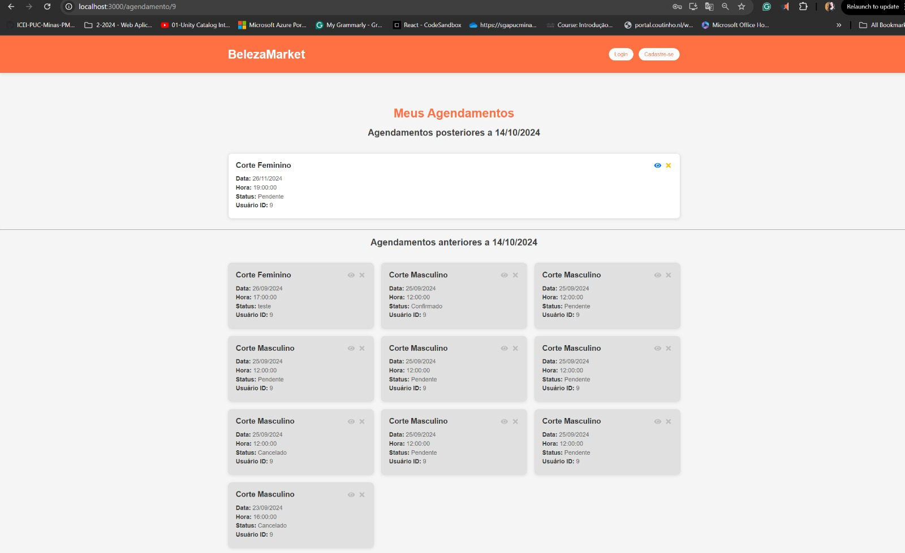
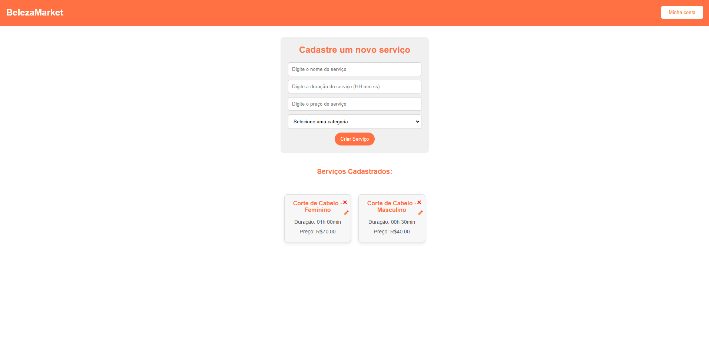
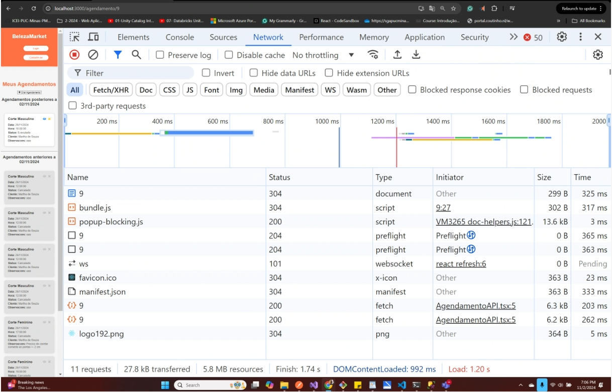

# Front-end Web
(https://github.com/ICEI-PUC-Minas-PMV-SI/pmv-si-2024-2-pe6-t2-g06-gestao-de-salao-react-ui) 

Este projeto é uma aplicação web destinada a salões de beleza, focada em otimizar o gerenciamento de agendas e serviços. O objetivo principal é facilitar o acesso de salões e clientes a funcionalidades essenciais de agendamento e controle de serviços.

Os salões de beleza podem usar a plataforma para visualizar a agenda de clientes e atualizar o status dos serviços realizados, garantindo um controle eficiente e simplificado das atividades diárias. Já os clientes, ao criar uma conta na aplicação, têm a facilidade de marcar e desmarcar seus agendamentos, gerenciando suas visitas de forma prática e rápida.

Esse projeto visa melhorar a comunicação e a organização entre salões e clientes, proporcionando uma experiência de usuário intuitiva e funcional para ambas as partes.

## Tecnologias Utilizadas
.NET Core: Utilizado no desenvolvimento da API, construído no Visual Studio, garantindo uma base robusta para o backend e facilitando a integração com o front-end e banco de dados.
Arquitetura de Microserviços: A aplicação é organizada em microserviços, promovendo escalabilidade, fácil manutenção e melhor distribuição das responsabilidades entre diferentes serviços.
API Gateway: Implementado para gerenciar e direcionar as requisições aos microserviços corretos, melhorando a segurança e a organização das rotas da aplicação.
React com TypeScript: Utilizado no desenvolvimento do front-end, fornecendo uma interface dinâmica e responsiva para os usuários, com os benefícios da tipagem estática para maior segurança e manutenção do código.
Microsoft SQL Server: Banco de dados centralizado, onde são armazenadas todas as informações essenciais, incluindo os dados dos clientes e agendamentos, permitindo consultas eficientes e seguras.
Essas tecnologias trabalham juntas para fornecer uma aplicação web escalável, organizada e de fácil manutenção, atendendo às necessidades específicas de salões de beleza e de seus clientes.

## Arquitetura

A aplicação adota uma arquitetura de microserviços para facilitar a escalabilidade, modularidade e manutenção. Abaixo, os principais componentes e suas interações:

API Gateway: O ponto de entrada centralizado da aplicação. Todas as requisições dos usuários são direcionadas ao API Gateway, que distribui as chamadas para os microserviços específicos. Ele também fornece segurança, gerenciamento de autorização/autenticação e balanceamento de carga.

Serviço de Autenticação e Autorização: Responsável por gerenciar as credenciais dos usuários e os tokens de autenticação. Utiliza JWT (JSON Web Tokens) para autenticar clientes e salões de beleza, garantindo acesso seguro às funcionalidades da aplicação.

Microserviço de Agendamento: Este serviço lida com o gerenciamento dos agendamentos. Permite que salões de beleza visualizem a lista de clientes agendados e que clientes possam criar, modificar ou cancelar agendamentos.

Microserviço de Cliente: Gerencia os dados dos clientes, como criação de conta, informações pessoais e histórico de agendamentos. Este serviço permite que os clientes mantenham seus dados atualizados e que os salões acessem informações pertinentes aos agendamentos.

Microserviço de Salão: Contém as funcionalidades específicas para o gerenciamento de perfis dos salões de beleza, incluindo informações de serviço e configuração de disponibilidade para agendamentos.

Banco de Dados Centralizado (Microsoft SQL Server): Um banco de dados centralizado onde todas as informações dos clientes, salões e agendamentos são armazenadas. Utilizamos tabelas relacionais e otimizações de consultas para garantir acesso eficiente e seguro aos dados.

Front-End (React com TypeScript): Uma aplicação cliente construída com React e TypeScript, onde clientes e salões interagem diretamente com a interface gráfica. Ele consome as APIs expostas pelos microserviços através do API Gateway.

Fluxo de Interação
Usuário Final: Um cliente ou salão faz login na aplicação através da interface do front-end.
API Gateway: A requisição é encaminhada ao serviço de autenticação para validação.
Microserviços: Uma vez autenticado, o usuário interage com os microserviços de acordo com sua função. Um cliente, por exemplo, pode fazer uma requisição ao microserviço de agendamento para marcar um horário, enquanto um salão pode acessar os detalhes de clientes marcados.
Banco de Dados: Todas as operações são registradas no banco de dados centralizado para persistência e histórico.
Essa arquitetura permite uma aplicação robusta e escalável, onde cada componente é isolado e especializado, promovendo uma estrutura organizada e de fácil manutenção.

## Modelagem da Aplicação

A modelagem da aplicação foi estruturada com o objetivo de organizar os dados e refletir as principais entidades envolvidas no processo de agendamentos e gerenciamento de salões de beleza. Abaixo, os detalhes da estrutura de dados e as entidades principais:

Estrutura de Dados e Entidades Principais
Usuário:

Representa tanto clientes quanto funcionários do salão (administradores).
Atributos: Id, Nome, Email, Senha, TipoUsuario (cliente ou salão), Telefone, DataCriacao.
Relações: Um usuário (cliente) pode ter vários agendamentos; um usuário (administrador) está relacionado a um ou mais salões.
Salão:

Armazena informações sobre o salão de beleza.
Atributos: Id, Nome, Endereco, Telefone, HorarioFuncionamento, Descricao, IdAdministrador.
Relações: Um salão possui um administrador (usuário do tipo salão) e está vinculado a vários agendamentos.
Agendamento:

Representa os agendamentos entre clientes e salões.
Atributos: Id, DataHora, Status (pendente, confirmado, cancelado), ClienteId, SalaoId, ServicoId.
Relações: Um agendamento está vinculado a um cliente (usuário), a um salão e a um serviço específico.
Serviço:

Contém os tipos de serviços oferecidos pelo salão (ex.: corte de cabelo, manicure).
Atributos: Id, Nome, Descricao, Preco, Duracao.
Relações: Um serviço pode ser oferecido em vários salões e fazer parte de vários agendamentos.
Histórico de Agendamentos:

Armazena o histórico de agendamentos realizados para auditoria e consultas futuras.
Atributos: Id, AgendamentoId, DataAlteracao, StatusAnterior, StatusAtual.
Relações: Está associado a um agendamento específico e contém as mudanças de status ao longo do tempo.

## Projeto da Interface Web

A interface foi projetada para ser intuitiva e eficiente, com design responsivo e paleta de cores neutras. O layout é dividido em:

Página Inicial: Apresentação do salão, serviços e botões de Login/Cadastro.
Cadastro/Login: Formulário para criação de conta e login de clientes e administradores.
Painel do Cliente: Agendamentos futuros, opções de marcação/cancelamento, histórico e perfil.
Painel do Administrador: Visualização da agenda, gerenciamento de clientes e relatórios.
Agendamento: Escolha de serviço, data e hora.
Confirmação e Feedback: Confirmação de agendamentos e formulário de feedback.
A interface é responsiva e acessível, garantindo uma experiência fluida em todos os dispositivos.

### Wireframes

### Design Visual

O design visual da aplicação utiliza uma paleta de cores que reflete um ambiente de beleza e bem-estar. A base inclui tons neutros e pastéis, combinados com um tom suave de laranja para criar um ambiente acolhedor e moderno.

Tons Neutros: Cores como cinza claro e bege servem como pano de fundo, proporcionando um visual limpo e organizado.
Toques de Laranja: O laranja é utilizado em botões, links e elementos de destaque, conferindo vivacidade e facilitando a identificação das principais ações.
Equilíbrio Visual: Essa paleta cria uma sensação de calma, enquanto o laranja adiciona energia e sofisticação, refletindo a identidade visual de salões de beleza.
Essa combinação torna a interface visualmente agradável e intuitiva, promovendo uma navegação suave e profissional para o usuário.

### Layout Responsivo

O design foi implementado seguindo práticas de responsividade para que a aplicação seja acessível em diversos dispositivos, como celulares, tablets e desktops. Além disso, aspectos de acessibilidade foram considerados, como:

Contraste adequado para texto e botões;
Navegação simplificada;
Uso de labels descritivos em campos de formulário para auxiliar tecnologias assistivas.
Essa estrutura permite uma navegação intuitiva e rápida, facilitando o agendamento de serviços e o gerenciamento de dados pelo salão e clientes. O projeto foi desenvolvido pensando em eficiência e usabilidade para entregar uma experiência satisfatória e completa.

### Interações do Usuário

Confirmação e Cancelamento de Agendamentos:

Clientes e administradores podem confirmar ou cancelar um agendamento diretamente no painel.
Ao cancelar, um modal confirma a ação para evitar cancelamentos acidentais.
Notificações:

Notificações de agendamentos futuros e lembretes de confirmação são exibidas no painel do cliente e do administrador.
Cada notificação possui uma marcação de status (pendente, confirmado, cancelado).
Feedback Pós-Serviço:

Após a finalização do serviço, clientes recebem uma notificação para avaliar o atendimento e o serviço realizado.
Filtros e Pesquisa:

Em todas as listas de agendamentos e históricos, clientes e administradores têm acesso a filtros por data, status e serviço, além de uma barra de pesquisa.

## Fluxo de Dados
Diagrama de sequencia:
#### 1 - Usuario

#### 2 - Agendamento

#### 3 - Servicos

#### 4 - Pagamentos

Fluxo geral da aplicação.

O fluxo de dados na aplicação segue uma arquitetura de microserviços, garantindo que cada componente lide de maneira eficiente e independente com suas próprias funções. Abaixo está uma descrição simplificada do fluxo:

Solicitações do Usuário: O cliente (usuário final) acessa a interface web através do navegador, onde pode realizar ações como criar uma conta, agendar um serviço, ou gerenciar seus agendamentos.

Front-end (React TS): A interface web em React TS recebe as interações dos usuários e se comunica com o back-end para enviar ou receber dados via API.

API Gateway: Todas as solicitações do front-end passam pelo API Gateway, que gerencia as rotas e distribui as requisições aos microserviços corretos, garantindo segurança e escalabilidade.

Microserviços: Cada microserviço é responsável por uma função específica, como:

Autenticação: valida as credenciais dos usuários.
Agenda: gerencia agendamentos de serviços.
Clientes: gerencia informações dos clientes e o histórico de serviços.
Banco de Dados (SQL Server): Os dados são armazenados de forma centralizada no Microsoft SQL Server, onde são salvos e recuperados conforme necessário, incluindo informações de usuários, agendamentos, e histórico de serviços.

Resposta ao Cliente: Após o processamento da solicitação, o back-end retorna os dados para o front-end através do API Gateway, onde são exibidos ao usuário na interface.

Esse fluxo permite uma comunicação organizada e eficiente, garantindo que cada ação seja rapidamente processada e retornada ao usuário.

## Requisitos Funcionais

| ID     | Descrição do Requisito                                                                                        | Tipo        |  Prioridade|
|--------|---------------------------------------------------------------------------------------------------------------|-------------|------------|
| RF-001 | O Layout deve ser responsivo, adaptando-se para telas menores, como dispositivos móveis.                      | LAYOUT      | ALTA       |
| RF-002 | Uilizar uma paleta de cores que reforce a identidade visual da marca.                                         | LAYOUT      | ALTA       |
| RF-003 | Mensagens de validação devem aparecer em tempo real para corrigir erros antes de submeter o formulário.       | UX          | ALTA       |
| RF-004 | Campos de Entrada: Garantir que todos os campos sejam intuitivos e fáceis de preencher                        | UX          | ALTA       |

## Requisitos Não Funcionais

| *ID*      | *Categoria*      | *Descrição*                                                                                                                                                                      | *Prioridade* |
|-----------|------------------|----------------------------------------------------------------------------------------------------------------------------------------------------------------------------------|--------------|
| RNF-01    | *Desempenho*     | *Tempo de Resposta*: A aplicação deve carregar as principais funcionalidades, como login e seleção de serviços, em até 1 segundo, idealmente medido em milissegundos.             | Alta         |
| RNF-02    | *Desempenho*     | *Escalabilidade*: O sistema deve suportar entre 20 a 100 acessos simultâneos sem perda significativa de desempenho.                                                              | Média        |
| RNF-03    | *Desempenho*     | *Capacidade de Processamento*: A aplicação deve processar múltiplas requisições simultâneas, especialmente durante horários de pico, sem afetar a performance.       | Alta         |
| RNF-04    | *Usabilidade*    | *Interface Amigável*: A interface deve ser intuitiva e otimizada para dispositivos móveis e navegadores web, facilitando a navegação entre páginas de cadastro, escolha de serviços e agendamento. | Alta         |
| RNF-05    | *Usabilidade*    | *Compatibilidade*: A aplicação deve ser responsiva e garantir uma excelente experiência em dispositivos móveis (Android e iOS) e em navegadores web modernos. | Alta         |
| RNF-06    | *Usabilidade*    | *Documentação Básica*: Incluir uma breve documentação ou tutorial que ajude os usuários a entender como usar a aplicação.                                                         | Média        |
| RNF-07    | *Segurança*      | *Autenticação*: Implementar autenticação básica para garantir que apenas pessoas autorizadas possam acessar ou modificar informações.                                                | Alta         |
| RNF-08    | *Segurança*      | *Hashing Simples*: Implementar hashing para senhas utilizando um algoritmo de pelo menos 256 bits para garantir a segurança.                                                     | Alta         |
| RNF-09    | *Segurança*      | *Proteção de Dados Pessoais*: Armazenar dados pessoais dos usuários de forma segura, utilizando o hashing de senhas especificado acima.                                           | Alta         |
| RNF-10    | *Confiabilidade* | *Backup Semanal*: Realizar backups semanais dos dados críticos, com automatização para garantir a segurança e recuperação dos dados.               | Média        |
| RNF-11    | *Confiabilidade* | *Estabilidade Básica*: A aplicação deve funcionar de forma estável durante as demonstrações e testes, sem quedas frequentes.                                                     | Alta         |
| RNF-12    | *Maneabilidade*  | *Código Limpo e Bem Comentado*: Garantir um código organizado e comentado facilita a manutenção e a compreensão por outros desenvolvedores. | Baixa        |
| RNF-13    | *Portabilidade*  | *Compatibilidade com Sistemas Operacionais e Navegadores*: A aplicação deve ser compatível com dispositivos móveis rodando Android e iOS e com navegadores web modernos.   

## Considerações de Segurança

A aplicação foi projetada com uma série de medidas de segurança para proteger os dados dos usuários e garantir a integridade do sistema:

Autenticação e Autorização Segura:

Implementação de autenticação usando JWT (JSON Web Tokens), garantindo que apenas usuários autenticados possam acessar dados sensíveis.
Controle de autorização para diferenciar acessos entre administradores e clientes, restringindo operações críticas a perfis com permissões apropriadas.

Proteção contra Ataques Comuns:

Prevenção contra SQL Injection: Uso de ORM (Entity Framework Core) para consultas parametrizadas e segurança no acesso ao banco de dados.
Proteção contra XSS e CSRF: Sanitização de entradas de usuário e uso de tokens CSRF para proteger formulários e ações autenticadas na aplicação.

Comunicação Segura:
TLS (Transport Layer Security) é usado para criptografar todas as comunicações entre cliente e servidor, prevenindo interceptação de dados sensíveis.
API Gateway: Age como ponto central para validação e roteamento de requisições, reforçando segurança e gerenciamento de acesso.

Políticas de Senhas e Segurança de Dados:

Requisitos de senha e encriptação de senhas antes do armazenamento.
Regras de expiração de sessão e limpeza de dados sensíveis para proteger informações pessoais em caso de inatividade.

## Implantação

1. Requisitos de Hardware e Software
Hardware:
VM recomendada: B2s (2 vCPUs, 4 GB RAM) para ambientes pequenos. Para produção, considere B2ms ou superior.

Software:
Sistema Operacional: Windows Server ou Linux (Ubuntu).
.NET Core SDK e Runtime.
Microsoft SQL Server (Azure SQL Database para simplificar a gestão).
Node.js e npm (para o front-end).

3. Plataforma de Hospedagem
Utilize os serviços do Microsoft Azure:

Azure App Service: Para hospedar a API .NET Core.
Azure SQL Database: Para gerenciar o banco de dados sem precisar configurar servidores.
Azure Blob Storage: Para armazenar arquivos estáticos da aplicação front-end.

3. Configuração do Ambiente de Implantação
Crie uma Azure SQL Database:

Configure as definições iniciais, como nome, tamanho e região.
Anote a string de conexão, que será usada pela aplicação.
Configure o App Service:

Crie um novo App Service e selecione a pilha de tecnologia (.NET Core).
Defina as variáveis de ambiente necessárias nas configurações do App Service, incluindo a string de conexão do banco de dados e outras credenciais.
Prepare o armazenamento para arquivos estáticos:

Crie um Azure Blob Storage para hospedar o front-end.

4. Deploy da Aplicação
Deploy da API .NET Core:

Utilize o Azure DevOps ou GitHub Actions para CI/CD.
Configure o pipeline para compilar e publicar a aplicação diretamente no App Service.
Deploy do Front-end React:

Compile a aplicação usando npm run build.
Faça o upload dos arquivos estáticos gerados para o Azure Blob Storage. Configure o blob para servir arquivos estáticos.

5. Testes de Verificação
Após o deploy, realize os seguintes testes:
Testes de Funcionalidade: Acesse a URL do App Service para garantir que a API esteja respondendo corretamente.
Testes de Performance: Utilize o Azure Monitor para monitorar o desempenho da aplicação e fazer ajustes conforme necessário.
Testes de Segurança: Use o Azure Security Center para verificar vulnerabilidades e aplicar recomendações de segurança.
Esses passos garantem que a aplicação esteja operando de maneira eficiente e segura no Azure, aproveitando a escalabilidade e as funcionalidades integradas da plataforma.

## Testes

